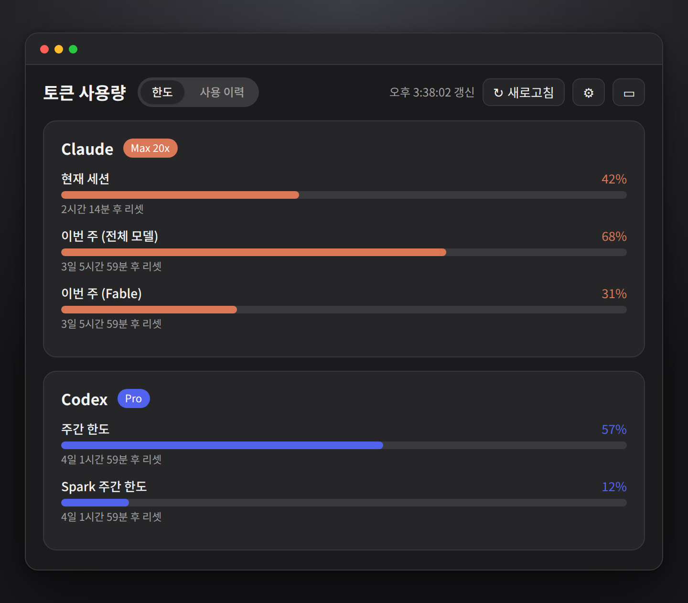
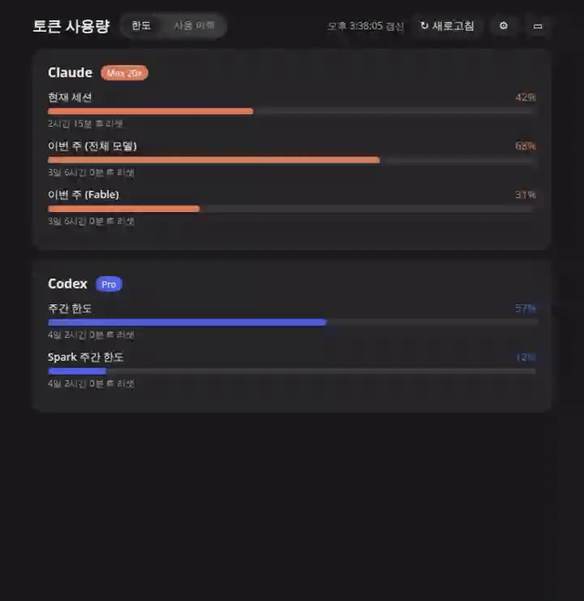
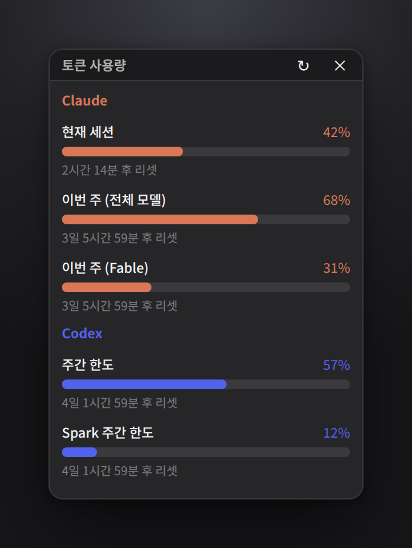
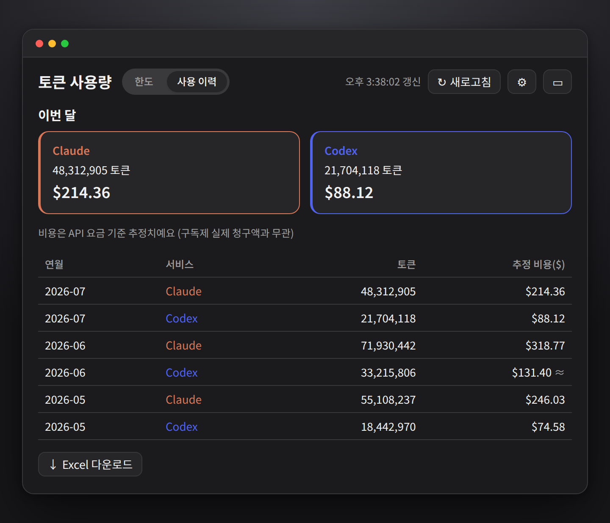
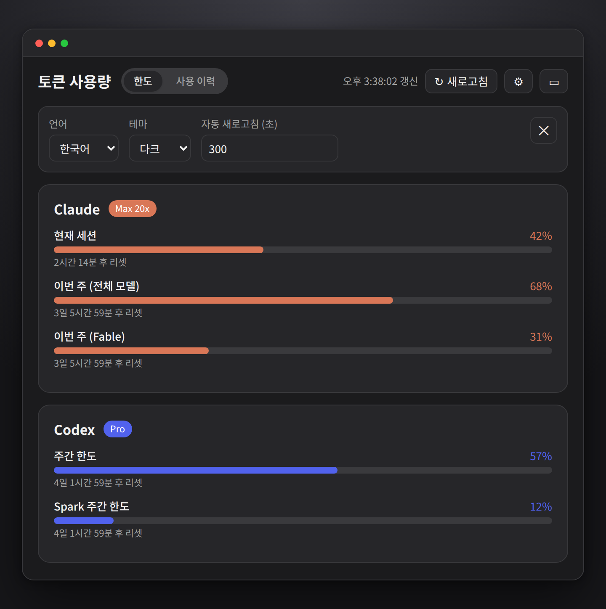

# Token Usage App

Claude와 Codex를 구독제로 사용하는 사람을 위한 **Tauri 기반 데스크톱 앱**입니다.
두 서비스의 토큰/사용량 한도와 리셋 시각을 막대 바로 한눈에 보여줍니다.

- **Claude** (강조색 `#D97757`) — 현재 세션, 주간(all models / Fable) 한도와 리셋 시각
- **Codex** (강조색 `#5162ED`) — 주간 한도, GPT-5.3-Codex-Spark 주간 한도
- 다크/라이트 모드, 영어·한국어 전환, 한도 임박 알림, 수동·자동 새로고침, 시스템 트레이

스택: React + TypeScript + Vite (프런트엔드) / Rust + Tauri v2 (백엔드)

## 화면



한도 확인 → 월별 사용량 → 테마·언어 전환 → 미니 위젯까지, 실제 사용 흐름입니다.



<details>
<summary>화면 더 보기 — 미니 위젯 · 사용 이력 · 설정</summary>

**미니 위젯** — 항상 위에 떠 있는 작은 창. 본문을 클릭하면 메인 창이 열립니다.



**사용 이력** — 월별 토큰 사용량과 API 요율 기준 추정 비용. Excel로 내려받을 수 있습니다.



**설정** — 언어, 테마, 자동 새로고침 주기.



</details>

> 위 이미지는 데모용 예시 데이터로 만든 것이라, 실제 화면의 숫자와는 다릅니다.
> 다시 만들려면 `npm run screenshots` — 자세한 내용은 [개발자 안내](#스크린샷-다시-만들기)를 보세요.

## 토큰 집계 방식

화면의 대표 수치는 **직접 사용**(입력 + 출력)입니다. 캐시 읽기는 대화 컨텍스트를 매 턴
다시 참조하며 쌓이는 값이라 실측에서 전체의 90%를 넘기는 일이 흔하고, 그대로 합산하면
체감 사용량과 크게 어긋납니다. 캐시 포함 총합은 카드의 보조 줄과 월별 행 확장에서 볼 수
있고, Excel 내보내기에는 버킷별 원본 값이 모두 들어갑니다.

두 서비스는 로그의 회계 방식이 다릅니다. Claude는 캐시 읽기를 별도 필드로 보고하지만,
Codex는 `input`에 캐시 읽기를 포함시키고 그중 캐시분을 `cached_input`으로 따로 표시합니다.
앱은 Codex의 `input`에서 `cached_input`을 빼서 두 서비스의 "직접 사용"이 같은 것을 뜻하도록
맞춥니다. Excel의 원시 버킷 컬럼은 대조가 가능하도록 로그 원본 값을 그대로 유지합니다.

## 다운로드 및 설치

최신 설치 파일은 **[GitHub Releases](https://github.com/donghoon-bigvalue/token-usage-app/releases/latest)** 에서 내려받을 수 있습니다.

| 플랫폼 | 파일 | 설치 방법 |
| --- | --- | --- |
| **Windows** | `token-usage-app_<버전>_x64_en-US.msi` 또는 `..._x64-setup.exe` | 내려받아 실행 후 안내를 따릅니다. |
| **macOS (Intel·Apple Silicon 공용)** | `token-usage-app_<버전>_universal.dmg` | 열어서 앱을 `Applications` 폴더로 끌어다 놓습니다. (1.0.3 버전부터 제공) |
| **Linux (범용)** | `token-usage-app_<버전>_amd64.AppImage` | 실행 권한을 주고 바로 실행합니다. |
| **Linux (Debian·Ubuntu)** | `token-usage-app_<버전>_amd64.deb` | `sudo dpkg -i <파일>` 또는 `sudo apt install ./<파일>` |
| **Linux (Fedora·RHEL)** | `token-usage-app-<버전>-1.x86_64.rpm` | `sudo rpm -i <파일>` 또는 `sudo dnf install ./<파일>` |

### Linux — AppImage 실행

```bash
chmod +x token-usage-app_*_amd64.AppImage
./token-usage-app_*_amd64.AppImage
```

> **Windows 참고** — 코드 서명이 적용돼 있지 않아 첫 실행 시 SmartScreen 경고가 뜰 수 있습니다. **추가 정보 → 실행**을 눌러 진행하세요.
>
> **macOS 참고** — 코드 서명·공증(notarization)이 적용돼 있지 않아 첫 실행 시 *"확인되지 않은 개발자"* 경고가 뜹니다. 앱을 **우클릭(또는 Control-클릭) → 열기**로 실행하면 진행할 수 있습니다. 그래도 *"손상되었기 때문에 열 수 없습니다"* 라고 나오면, 터미널에서 격리 속성을 제거하세요:
>
> ```bash
> xattr -dr com.apple.quarantine /Applications/token-usage-app.app
> ```

소스에서 직접 빌드하려면 아래 개발자 안내를 참고하세요.

## 사전 준비 (최초 1회)

### 1. Node 의존성

```bash
npm install
```

Node는 최신 LTS 이상을 권장합니다.

### 2. Rust 툴체인

[rustup](https://rustup.rs/)으로 Rust를 설치합니다. 설치 후 PATH에 `cargo`가 없다면:

```bash
export PATH="$HOME/.cargo/bin:$PATH"
```

### 3. 시스템 라이브러리 (Linux / WSL2)

Ubuntu·Debian 계열에서는 Tauri 빌드에 다음 패키지가 필요합니다:

```bash
sudo apt install -y libwebkit2gtk-4.1-dev libgtk-3-dev \
  libayatana-appindicator3-dev librsvg2-dev patchelf libxdo-dev libssl-dev
```

> **WSL2 참고**
> - Homebrew의 `pkg-config`가 시스템 것을 가려 빌드가 깨질 수 있어, `src-tauri/.cargo/config.toml`에 `PKG_CONFIG_PATH`가 커밋되어 있습니다. 이 설정이 적용되려면 **cargo/Tauri 명령을 항상 프로젝트 루트에서** 실행하세요 (`--manifest-path`로 우회하면 깨집니다).
> - WSLg에서 실행 시 `libEGL`/`MESA`/`Gtk-CRITICAL` 경고가 뜰 수 있지만 소프트웨어 렌더링에 따른 것으로 무시해도 됩니다.

macOS·Windows는 Tauri [사전 준비 문서](https://tauri.app/start/prerequisites/)를 참고하세요.

## 실행

### 개발 모드 (데스크톱 창)

```bash
npm run tauri dev
```

### 프런트엔드만 (브라우저)

```bash
npm run dev        # http://localhost:1420
```

## 빌드

```bash
npm run tauri build
```

실행 파일과 설치 번들(`.deb`/`.rpm`/AppImage)이 `src-tauri/target/release/bundle/` 아래에 생성됩니다.

> **WSL2 참고 — 번들 단계 `PKG_CONFIG_PATH`**
> Homebrew의 `pkg-config`가 시스템 것을 가리는 환경에서는, `libayatana-appindicator3-dev`가 설치돼 있어도 번들 단계에서 `Can't detect any appindicator library` 오류가 날 수 있습니다. `src-tauri/.cargo/config.toml`의 `PKG_CONFIG_PATH`는 cargo가 스폰하는 프로세스에만 적용되고 번들링을 수행하는 `tauri-cli`(npm) 프로세스에는 적용되지 않기 때문입니다. 빌드 셸에 직접 지정하세요:
>
> ```bash
> export PKG_CONFIG_PATH="/usr/lib/x86_64-linux-gnu/pkgconfig:/usr/share/pkgconfig:/usr/lib/pkgconfig"
> npm run tauri build
> ```

## 테스트

```bash
npm test           # vitest 1회 실행
npm run test:watch # 워치 모드
```

## 스크린샷 다시 만들기

README의 이미지는 `docs/images/` 아래에 있고, 명령 한 번으로 다시 만듭니다.

```bash
npm run screenshots
```

Rust 백엔드도, 실제 Claude/Codex 계정도 필요 없습니다. 프런트엔드가 백엔드와 통신하는
`window.__TAURI_INTERNALS__`를 통째로 스텁으로 바꿔치기해서, 실제 화면을 데모용 고정
데이터로 렌더한 뒤 Chromium으로 촬영합니다. 하네스는 `scripts/screenshots/`에 있고
데모 데이터는 `fixtures.ts`에서 고칩니다.

준비물:

```bash
sudo apt install ffmpeg fonts-noto-cjk   # GIF 변환 + 한글 폰트
```

UI에 새 백엔드 커맨드가 추가되면 캡처가 *조용히 깨지는 대신* 해당 커맨드 이름과 함께
실패합니다. `scripts/screenshots/tauri-stub.ts`에 응답을 추가하세요.

## 문서

- 설계 문서: `docs/superpowers/specs/2026-07-14-token-usage-app-design.md`
- 구현 계획: `docs/superpowers/plans/2026-07-14-token-usage-app.md`

## 권장 IDE 설정

[VS Code](https://code.visualstudio.com/) + [Tauri](https://marketplace.visualstudio.com/items?itemName=tauri-apps.tauri-vscode) + [rust-analyzer](https://marketplace.visualstudio.com/items?itemName=rust-lang.rust-analyzer)

## 라이선스

이 프로젝트는 [MIT License](LICENSE)로 배포됩니다.

## 자동 업데이트

앱은 시작 시 하루 1회 최신 버전을 확인하고, 새 버전이 있으면 팝업으로 안내합니다.
`[자동 업데이트]`를 누르면 내려받아 설치 후 재시작하고, `[다음에 하기]`를 누르면 해당
버전은 다시 묻지 않습니다. 설정 화면에서 **현재 버전 확인**과 **수동 업데이트 확인**도
가능합니다.

### 강제 업데이트 (킬 스위치)

구버전을 더 이상 쓰게 두면 안 될 때, **앱 릴리스 없이** 구버전 사용자를 막을 수 있습니다.
정책은 별도 공개 저장소의 JSON 파일 하나로 관리합니다.

- 저장소: [donghoon-bigvalue/token-usage-app-config](https://github.com/donghoon-bigvalue/token-usage-app-config)
- 파일: `force-update.json` (main 브랜치 루트) — 예시는 [`docs/force-update.example.json`](docs/force-update.example.json)

```json
{
  "minimumVersion": "1.0.5",
  "message": {
    "ko": "더 안정적인 서비스 제공을 위해 최신 버전으로의 업데이트가 필요합니다. 업데이트 후 이용해 주세요.",
    "en": "Please update to the latest version for a more reliable experience. Update to continue using the app."
  }
}
```

- `minimumVersion` **미만**인 앱은 닫을 수 없는 팝업을 띄웁니다. 평시에는 `0.0.0`으로 두세요.
- `message`는 선택입니다 — 없으면 앱 내장 문구를 씁니다.
- 앱은 **시작할 때마다** 이 파일을 확인합니다(하루 1회 업데이트 확인 스로틀과 무관).
  raw CDN 캐시가 5분이라 반영까지 최대 몇 분 걸립니다.
- 강제가 걸리면 업데이트 확인도 스로틀을 무시하고 실행해 인앱 설치 버튼을 제공합니다.

강제 상태의 팝업에서는 `[다음에 하기]`가 사라지고 `[다운로드 페이지 열기]`(릴리스 페이지)가
기본 버튼이 됩니다. 이전에 같은 버전을 "다음에 하기"로 넘겼더라도 다시 표시됩니다.

**운영 규칙**

1. `minimumVersion`은 **이미 퍼블리시된 릴리스 이하**로만 올리세요. 더 높이면 사용자가
   받을 것 없는 팝업에 갇힙니다(이 경우 다운로드 페이지 안내만 표시).
2. config 저장소는 **public**을 유지하세요. private으로 바꾸면 정책이 무력화됩니다.
3. 저장소·파일 경로는 앱에 하드코딩되므로 바꾸지 마세요.

> 정책 조회가 실패하면(오프라인·404·형식 오류) **강제하지 않습니다**. 네트워크 사고로
> 앱을 못 쓰게 만드는 쪽이 더 나쁘기 때문입니다.

### 유지관리자 셋업 (최초 1회)

1. 서명 키페어 생성: `npm run tauri signer generate -- -w ~/.tauri/token-usage-app.key`
2. 출력된 **Public key**를 `src-tauri/tauri.conf.json`의 `plugins.updater.pubkey`에 반영.
3. GitHub Secrets 등록:
   - `TAURI_SIGNING_PRIVATE_KEY` = 개인키 파일 내용
   - `TAURI_SIGNING_PRIVATE_KEY_PASSWORD` = 개인키 비밀번호
4. `v*` 태그를 push하면 CI가 서명된 설치 파일과 `latest.json`을 Draft 릴리스에 올립니다.
   내용을 확인한 뒤 릴리스를 **Publish**하면 사용자에게 업데이트가 배포됩니다.

### 한계

- **Linux**: AppImage만 자동 업데이트를 지원합니다. `.deb`/`.rpm` 사용자는 릴리스
  페이지에서 수동으로 새 버전을 내려받아야 합니다.
- **OS 코드서명 미적용**: 설치·실행 시 Windows SmartScreen 또는 macOS Gatekeeper 경고가
  나타날 수 있습니다. 이는 업데이트 서명(minisign)과는 별개이며 자동 업데이트 동작에는
  영향을 주지 않습니다. OS 코드서명은 별도 이슈로 다룹니다.
